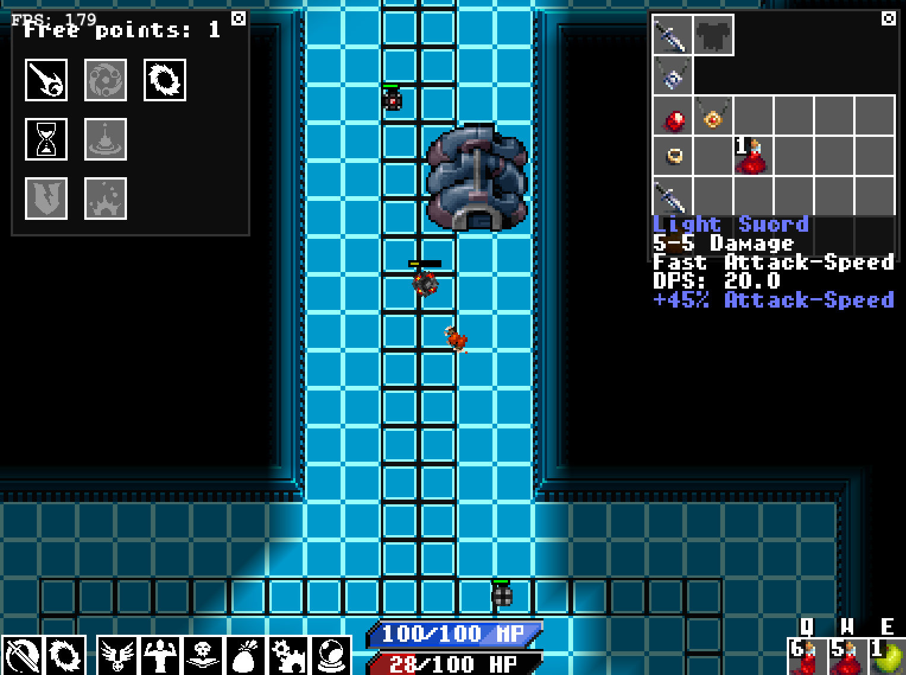

# cdq
Action Video Game written in Clojure

```
development=false lein run
```

Make sure you have the correct native libraries set up in `project.clj` (osx, windows or linux). On macOS after `lein deps`, run `bash scripts/prepare-osx-natives.sh` (Legacy Fabric dylib names).

## macOS note

This tree is Slick2D + LWJGL 2. On modern macOS the process reaches the game loop (`Display.update`) but **no Cocoa window appears** — stock LWJGL 2's Mac display backend is effectively dead there. `-XstartOnFirstThread` is required and already set; it is not enough.

For a Mac build, use the LWJGL 3 rewrite in [`cyberdungeon`](../cyberdungeon) (`lein game`).

__This project was a learning experience for me in 2010, this is not idiomatic clojure__




Videos:

* https://www.youtube.com/watch?v=gVRvadHqaT8
* https://www.youtube.com/watch?v=71WBZr9RqDo
